# Playwright UI E2E Pipeline QA Automation Framework

프론트엔드(Playwright UI), 백엔드(Flask 목 서버 API), 인프라 배포(GitHub Actions + Render)를 하나의 파이프라인으로 연결한 **모듈형 다계층(Multi-Layer) 자동화 테스트 프레임워크**입니다.

테스트 케이스 유지보수성과 안정성 확보를 위해 다음을 적용했습니다:
- **POM(Page Object Model) 패턴**: `pages/base_page.py`를 상속하는 구조로 UI 요소와 테스트 로직을 분리
- **데이터 주도 테스트(DDT)**: 회원가입·결제·게시판 API 테스트 케이스를 CSV로 분리하고 Pandas로 동적 파싱하여 하드코딩 없이 대량 검증
- **Flaky Test 방지 장치**: 광고 네트워크 요청 차단(`conftest.py`), 타임아웃 값 중앙화(`config/settings.py`)로 UI 테스트의 불안정성을 최소화
- **배포 전 코드 검증**: CI 러너 안에서 Flask 목 서버(`app.py`)를 직접 기동해 `localhost:5001`을 대상으로 테스트하므로, 배포될 코드를 배포 전에 검증

단순 정상 흐름(Happy Path) 검증에 그치지 않고, 실제 서비스에서 발생 가능한 **보안·금융 엣지케이스**를 다룹니다:
- 관리자 페이지 무단 접근 차단 등 **RBAC 권한 제어** 검증
- 인증 토큰 누락/만료, 타 계정 권한 우회, 비정상 금액(0원·음수·한도 초과), 중복 트랜잭션 ID 재요청 등 **결제 API 응답 규약** 검증
- **자금세탁방지(AML) 한도 초과** 응답을 Playwright Network Interception(`route.fulfill`)으로 목킹해, 프론트엔드의 예외 안내 처리를 검증

CI/CD 파이프라인은 push/PR 및 매일 자정(KST) 정기 회귀 테스트로 실행되며, **테스트 대상(전체/API/UI/스모크) 수동 선택 실행**을 지원합니다. 테스트가 모두 통과하면(PR 제외) Render Deploy Hook을 호출해 목 서버를 재배포하고, 실패 시 **Slack 실시간 알림**(UI는 스크린샷 포함, API는 로그만)을 전송합니다.

**Author:** 지원자 이진행

## 🏗️ System Architecture

```mermaid
flowchart LR
 subgraph Trigger["0. Trigger"]
        T1["git push / Pull Request<br>(fix-clean-architecture)"]
        T2["매일 자정 스케줄<br>(KST 00:00)"]
        T3["수동 실행 workflow_dispatch<br>(전체 / API / UI / smoke)"]
  end
 subgraph Setup["1. Environment Setup"]
        D["Python 3.11"]
        C{"GitHub Actions<br>(.github/workflows/playwright.yml)"}
        E["requirements.txt 설치"]
        P["Playwright 브라우저 설치<br>(playwright install)"]
        S["Flask 목 서버 기동<br>(python app.py, localhost:5001)<br>: 서버 준비 응답 확인 후 진행"]
  end
 subgraph Execution["2. Automated Test Execution (PyTest)"]
        F{"PyTest Runner<br>(pytest.ini / conftest.py)"}

        G1["AE 시나리오 테스트<br>(tests/ui/e2etest_*.py)<br>: Automation Exercise 대상 시나리오 검증"]
        G2["목 서버 UI 검증<br>(test_web_e2e.py, test_payment_exceptions.py)<br>: 관리자 접근 차단(RBAC), AML 한도 초과 목킹"]

        H["API DDT 테스트<br>(tests/api/test_unified_api_ddt.py)<br>: 목 서버 API 데이터 주도 테스트"]

        I1[("UI 테스트 데이터<br>(data/*_test_data.py)")]
        I2[("CSV API 데이터<br>(data/*_api_test.csv)")]
  end
 subgraph Report["3. Reporting & Deployment"]
        K["pytest-html 결과 병합"]
        L["report.html, test-results(스크린샷·트레이스),<br>flask.log 아티팩트 업로드 (7일 보관)"]
        M["Render Deploy Hook 호출<br>: 성공 시, PR 제외"]
        N1["Slack 알림 (rtCamp/action-slack-notify)<br>파이프라인 실행 결과(성공/실패) 요약"]
        N2["Slack Bot (utils/slack_bot.py)<br>테스트 실패 시 스크린샷 + 에러 로그"]
  end
 subgraph Target["4. Target Servers"]
        J0[("CI 러너 내 Flask 서버<br>(app.py, localhost:5001)<br>: 배포 전 새 코드 검증 대상")]
        J1[("Automation Exercise<br>(External Target Web)")]
        J2[("Render Server<br>(app.py 배포 환경)")]
  end

    A["QA 엔지니어"] -- "1. git push" --> B("GitHub Repository")
    B --> T1
    T1 -- "2. Workflow Trigger" --> C
    T2 --> C
    T3 --> C
    C --> D
    D --> E
    E --> P
    P --> S
    S ----> F

    F -- "AE Scenario Test" --> G1
    F -- "Local UI Test" --> G2
    F -- "Local API Test" --> H

    I1 -. "UI 테스트 데이터 로드" .-> G1
    I2 -. "CSV 데이터 파싱<br>(utils/data_reader.py)" .-> H

    S -. "백그라운드 기동" .-> J0

    G1 ----> K
    G2 ----> K
    H ----> K

    K -- "3. Generate Report" --> L
    L -- "4. If All Passed" --> M
    L -- "4. Notify Result (항상)" --> N1
    F -. "테스트 실패 시 (conftest 훅)" .-> N2

    G1 -. "브라우저 상호작용" .-> J1
    G2 -. "브라우저 상호작용" .-> J0
    H -. "API 호출<br>(utils/api_client.py)" .-> J0
    M -- "5. 배포" --> J2
```



본 프레임워크는 독립적인 5개의 계층(Layer)으로 구성되어 동작합니다.

### 1. API Data-Driven Testing (DDT) Layer
* **Tech Stack:** PyTest, Requests, Pandas
* **Description:** 비즈니스 로직과 테스트 데이터를 분리했습니다. 하드코딩을 배제하고 CSV 포맷의 데이터를 Pandas로 파싱하여 회원가입, 결제, 게시판 API 엔드포인트를 동적으로 반복 검증합니다. 테스트 대상 서버는 환경변수(`API_BASE_URL`)로 지정하며, CI에서는 러너 내부의 목 서버를 사용합니다.

### 2. Web E2E UI Testing Layer
* **Tech Stack:** Playwright, PyTest
* **Description:** DOM 구조 변경에 유연하게 대응하기 위해 POM(Page Object Model) 패턴을 적용했습니다. 브라우저의 명시적 대기(Wait)와 예외 처리 로직을 중앙화하고, 광고 네트워크 요청을 컨텍스트 단에서 차단하는 픽스처를 두어 UI 테스트 특유의 불안정성(Flaky)을 최소화했습니다.

### 3. Security & Exception Handling Validation Layer
* **Tech Stack:** Playwright Network Interception, Flask(RBAC, 응답 규약)
* **Description:** 정상 흐름(Happy Path) 검증을 넘어 보안·금융 엣지케이스를 검증합니다. 일반 사용자의 관리자 페이지 강제 접근 차단(RBAC), 인증 토큰 누락/만료, 타 계정 권한 우회 시도, 비정상 금액 및 중복 트랜잭션 ID에 대한 응답 규약(400/401/403/409)을 API 테스트로 확인하고, 자금세탁방지(AML) 한도 초과 시나리오는 목 서버의 `/checkout` 화면에서 네트워크 응답을 가로채 주입(Network Interception)하는 방식으로 검증합니다.

### 4. CI/CD & Notification Layer
* **Tech Stack:** GitHub Actions, Slack SDK/Webhook, Gunicorn, Pytest-html
* **Description:**
  * **CI**: push/PR, 매일 자정(KST) 스케줄, `workflow_dispatch`(전체/API/UI/스모크 `-m smoke`)로 실행됩니다. 러너에서 Flask 목 서버를 기동하고 응답을 확인한 뒤 pytest를 수행하며, `report.html`·스크린샷·트레이스·`flask.log`를 아티팩트로 7일 보관합니다.
  * **CD**: 테스트가 모두 통과하고 PR이 아닌 경우에만 Render Deploy Hook(`RENDER_DEPLOY_HOOK_URL`)을 호출해 목 서버를 배포합니다.
  * **알림**: 파이프라인 실행 결과(성공/실패)는 워크플로우의 Slack 알림으로, 테스트별 실패 상세는 `utils/slack_bot.py`(Slack Bot)로 전송합니다. UI 테스트는 스크린샷과 에러 로그를, API 테스트는 로그만 보냅니다.

### 5. AI Vision Validation Layer (Upcoming)
* **Tech Stack:** YOLO, OpenCV
* **Description:** DOM 트리에 잡히지 않는 특수 렌더링 영역이나 캔버스를 검증하기 위해, 커스텀 객체 탐지 모델을 추론 파이프라인에 통합하는 시각적 회귀 테스트(VRT) 계층을 준비 중입니다. (설계 단계이며 아직 구현되지 않았습니다.)

## 🧪 Mock Server 범위와 한계

`app.py`는 테스트 대상으로 사용하는 **상태를 저장하지 않는 목(Mock) 서버**입니다.

* 인증 실패(401/403), 비정상 금액(400), 중복 트랜잭션(409)은 **약속된 입력값에 정해진 응답을 돌려주는 규약**으로 구현되어 있습니다. 예를 들어 `TX_DUPLICATE_01`은 처음 요청해도 409를 반환합니다.
* 따라서 이 프로젝트가 보여주는 것은 **자동화 구조와 예외 시나리오 설계·검증 흐름**이며, 실서비스의 멱등성·동시성·DB 정합성 검증은 범위 밖입니다.
* 실서비스에 적용한다면 기획서/API 명세에서 기대값을 도출하고, 동일 거래 ID의 순차·동시 요청과 DB 조회 검증을 추가해야 합니다.

## 🏷️ Test Markers
도메인/유형별로 테스트를 태깅하여 선택적 실행이 가능합니다.

| Marker | 설명 |
|---|---|
| `api` | 백엔드 API 응답 및 비즈니스 로직 검증 |
| `ui` | Playwright 기반 UI E2E 테스트 |
| `security` | 보안 및 권한(RBAC) 접근 관련 테스트 |
| `registration` | 회원가입 및 계정 생성 플로우 |
| `login` | 로그인/로그아웃 플로우 |
| `products` | 상품 탐색 및 장바구니 |
| `checkout` | 체크아웃 전체 플로우 (배송지~결제 완료) |
| `payment` | 결제 화면 및 결제 예외(AML 등) 처리 |
| `smoke` | 배포 직후 반드시 통과해야 하는 핵심 기능 (결제 성공, 관리자 접근 차단) |

예: `pytest -m security` 로 보안 테스트만, `pytest -m smoke` 로 핵심 기능만 선택 실행 가능

## 🚀 Quick Start (로컬 실행)

```bash
git clone https://github.com/playlee1026-cyber/git_remote_repo.git
cd git_remote_repo
python -m venv venv && source venv/bin/activate

pip install -r requirements.txt
pip install pytest pytest-playwright      # requirements.txt에는 포함되어 있지 않습니다
playwright install chromium
```

프로젝트 루트에 `.env`를 만듭니다. 목 서버는 `normal_user` / `admin_user` ID로 권한을 구분합니다.

```env
NORMAL_USER_ID=normal_user
NORMAL_USER_PASSWORD=<임의 값>
ADMIN_USER_ID=admin_user
ADMIN_USER_PASSWORD=<임의 값>

# 선택: Slack 실패 알림 (없으면 알림만 건너뜁니다)
SLACK_BOT_TOKEN=
SLACK_CHANNEL_ID=
```

```bash
# 터미널 1: 목 서버 실행 (localhost:5001)
python app.py

# 터미널 2: 테스트 대상을 로컬 목 서버로 지정하고 실행
export WEB_BASE_URL=http://localhost:5001
export API_BASE_URL=http://localhost:5001

pytest tests/api                                                     # API DDT
pytest tests/ui/test_payment_exceptions.py tests/ui/test_web_e2e.py  # 목 서버 UI 검증
pytest -m smoke                                                      # 스모크
```

`tests/ui/e2etest_*.py`는 외부 사이트(Automation Exercise)를 대상으로 하므로 인터넷 연결이 필요합니다. 환경변수를 지정하지 않으면 Render에 배포된 서버를 대상으로 실행됩니다.

## 🔐 GitHub Actions Secrets

| Secret | 용도 |
|---|---|
| `NORMAL_USER_ID`, `NORMAL_USER_PASSWORD` | 일반 사용자 로그인 (RBAC 테스트) |
| `SLACK_BOT_TOKEN`, `SLACK_CHANNEL_ID` | 테스트별 실패 알림 (`utils/slack_bot.py`) |
| `SLACK_WEBHOOK` | 파이프라인 실행 결과 요약 알림 |
| `RENDER_DEPLOY_HOOK_URL` | 테스트 통과 후 Render 배포 트리거 (Render 대시보드 Settings > Deploy Hook) |

---

## 📂 Directory Structure

```text
📦 git_remote_repo
 ┣ 📂 .github/workflows   # CI/CD 파이프라인 (playwright.yml) - 러너 내 목 서버 기동, 수동 타겟 선택, 배포 트리거
 ┣ 📂 config              # 전역 환경 변수 및 설정 중앙화 (settings.py)
 ┣ 📂 data                # API 테스트 CSV(회원가입/결제/게시판), UI 테스트 데이터(*_test_data.py)
 ┣ 📂 helpers             # 테스트 보조 함수 (고유 이메일 생성 등)
 ┣ 📂 pages               # 웹 UI 페이지 객체 (POM)
 ┃ ┗ 📂 automation_exercise   # Automation Exercise 대상 페이지 객체
 ┣ 📂 tests               # 실제 구동되는 테스트 스크립트 모음
 ┃ ┣ 📂 api               # API DDT 검증 스크립트
 ┃ ┗ 📂 ui                # Playwright E2E 검증 (회원가입/로그인/장바구니/체크아웃/RBAC/결제 예외)
 ┣ 📂 utils               # API 클라이언트, CSV 파싱(Pandas), Slack Bot 알림
 ┣ 📜 app.py              # Flask 목 서버 (로그인/RBAC/결제/게시판 API, /checkout 화면)
 ┣ 📜 conftest.py         # PyTest 전역 픽스처 (실패 시 스크린샷/Slack 알림 훅, 광고 네트워크 차단)
 ┣ 📜 pytest.ini          # 테스트 탐색 규칙 및 마커 정의
 ┗ 📜 requirements.txt    # 의존성 패키지 명세 (Flask, Gunicorn 등 배포 스택 포함)
```